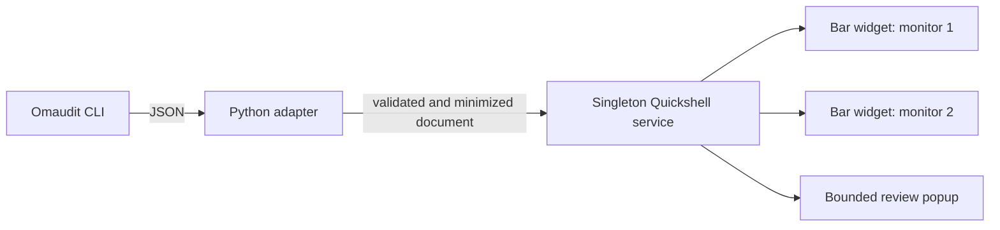

# Omaudit Status

[](https://github.com/godhiraj-code/omarchy-omaudit-status/actions/workflows/ci.yml)
[](LICENSE)

A native Omarchy 4/Quattro bar companion for [Omaudit](https://github.com/omarchy-forge/omaudit). It turns Omaudit's machine-readable plugin audit results into a compact shield indicator and keyboard-friendly review panel.

**Omaudit Status is not another scanner.** Omaudit remains the source of truth for capability discovery, baseline drift, findings, scores and grades.

> Capability findings are review signals, not proof that a plugin is malicious or safe. Omarchy plugins run with the current user's permissions; this project does not sandbox them.

## What it does

- Audits third-party plugins by default through `omaudit check --json`.
- Includes first-party Omarchy plugins only after explicit opt-in, using `omaudit check --json --all`.
- Shares one scan service across every monitor instead of launching one scanner per bar widget.
- Prevents overlapping scans and bounds the data retained by QML.
- Fails closed when output is malformed, unsupported, contradictory or incomplete.
- Opens Omaudit's detailed terminal review flow without accepting baselines or changing plugins.

## Status at a glance

| Shield | Meaning |
| --- | --- |
| Green | Tracked plugins are unchanged. |
| Amber | A plugin is not tracked or still needs baseline review. |
| Red | Capability drift or composition risk needs review. |
| Dim/error | Omaudit is unavailable, timed out, returned invalid data, or the last result is stale. |

The popup reports unchanged, changed, not-tracked and composition-risk totals, the worst current grade, and a bounded worst-first plugin list. Aggregate totals still cover the complete scan even when the displayed list is capped.

Refresh retains the last result with a refreshing/age indication. Results become stale after the configured interval plus 150 seconds (210–3750 seconds total); timestamps more than 30 seconds in the future are also stale. The tooltip and panel show freshness, and stale results cannot remain green. Errors appear as bounded plain text. Plugin IDs appear separately from names and grades; directional controls are visibly escaped while ordinary multilingual text is preserved.

## Architecture



The adapter invokes Omaudit with a fixed argument vector. Plugin-controlled names, paths and evidence are never interpolated into shell commands.

## Requirements

- Omarchy 4 with the Quattro shell on Linux; Windows is not a supported runtime
- [Omaudit](https://github.com/omarchy-forge/omaudit) v0.1.0 or newer on `PATH`
- Python 3.11 or newer
- Node.js only for development tests

Omaudit Status does not install or update Omaudit. Review and install Omaudit separately using its official documentation before enabling this plugin.

## Installation

```sh
omarchy plugin add https://github.com/godhiraj-code/omarchy-omaudit-status --enable --yes
```

## Usage

- **Click** the shield to open or close the popup.
- **Middle-click or right-click** the shield to refresh.
- Press **R** while the popup is open to refresh.
- Press **Escape** to close the popup.
- Use **Tab/arrows** to select an enabled action and bring it into view. Use **Page Up/Page Down/Home/End** to scroll the review content.
- Select **Review in terminal** to open Omaudit's interactive review flow with the current scope (`omaudit check` or `omaudit check --all`). When Omaudit is missing, Review is disabled; click the official instructions link or press **I** to open it for manual installation.

### Settings

| Setting | Default | Range/behavior |
| --- | ---: | --- |
| Refresh interval | 900 seconds | 60–3600 seconds |
| Include first-party plugins | Off | Adds `--all` only when enabled |

First-party auditing is off by default because stock Omarchy components legitimately use broad shell capabilities and can obscure third-party drift on an initial review.
Changing this scope immediately invalidates the previous result. If a scan is already running, its output is discarded and one scan with the new scope is queued.

## Local development installation

From a local checkout:

```sh
./scripts/install-local.sh
```

The helper validates the source, refuses to overwrite an existing installation, copies it into the local Omarchy plugin directory, rescans local plugins and enables it through Omarchy. A failed copy or enable removes only the destination newly created by that invocation, allowing a retry.

Equivalent manual commands:

```sh
SOURCE=/path/to/omaudit-status
omarchy plugin validate "$SOURCE"
mkdir -p ~/.config/omarchy/plugins
cp -a "$SOURCE" ~/.config/omarchy/plugins/godhiraj.omaudit-status
omarchy-shell shell rescanPlugins
omarchy plugin enable godhiraj.omaudit-status --section right
```

## Removal

```sh
./scripts/remove-local.sh
```

Equivalent manual commands:

```sh
omarchy plugin disable godhiraj.omaudit-status
omarchy plugin remove godhiraj.omaudit-status --yes
```

Omaudit is a separate tool and is deliberately left installed.

## Security boundaries

Omaudit Status has:

- no telemetry or network service;
- no automatic baseline acceptance;
- no automatic remediation, plugin disable/removal or update behavior;
- no requests for elevated privileges;
- no malware-detection or sandboxing claim.

On its supported Omarchy Linux runtime, the adapter runs Omaudit in an isolated process group, retains at most 8 MiB of stdout and 64 KiB of stderr, terminates the group on overflow, timeout or graceful cancellation, and applies the same 8 MiB ceiling to saved fixture input. It emits ASCII-safe JSON so arbitrary stream boundaries cannot split Unicode code points; Python and JavaScript field limits both count code points. QML retains at most 2 MiB characters, discards stderr, requires a normal zero adapter exit, and imposes independent 10-second startup and 150-second execution deadlines. Cancellation sends SIGTERM for scanner cleanup, with a SIGKILL fallback after 5 seconds. Any failure is non-green. Hard-killing an unresponsive adapter cannot guarantee cleanup of its separate scanner session; see the threat model.

The adapter and QML model independently validate the status document. Malformed dates, contradictory totals, duplicate plugin identities, unsupported grades/statuses and inconsistent evidence also fail visibly.

Read the [threat model](docs/THREAT_MODEL.md) and [security policy](SECURITY.md) for the complete trust boundary and reporting process.

## Verification

Earlier release validation recorded:

- the official Omarchy plugin validator;
- real Omaudit default and `--all` scans;
- a real Omarchy 4/Quattro desktop with two monitors;
- singleton IPC and overlapping-refresh checks;
- green, amber, red and error-state validation;
- 38 Python contract, lifecycle and oversized-output tests;
- adversarial JavaScript status-model tests;
- Linux shell syntax and Git whitespace checks.

The 0.1.3 reliability changes add executable service-policy and keyboard-scroll probes, real adapter-to-model round trips, and Linux tests using fake scanners and temporary homes for cancellation and partial-copy failure. These probes do not establish native Quickshell loading, signal delivery, visual layout or desktop keyboard behavior. Parent verification on Omarchy remains required. Process API evidence and version uncertainty are recorded in the [threat model](docs/THREAT_MODEL.md).

Run the repository checks locally:

```sh
python -m unittest discover -s tests -p "test_*.py" -v
node --check StatusModel.js
node --test tests/*-test.mjs
bash -n scripts/install-local.sh scripts/remove-local.sh
python -m json.tool manifest.json >/dev/null
omarchy plugin validate .
```

Node.js is not required at runtime. The adapter uses only the Python standard library.

## License

[MIT](LICENSE) © 2026 Dhiraj Das
